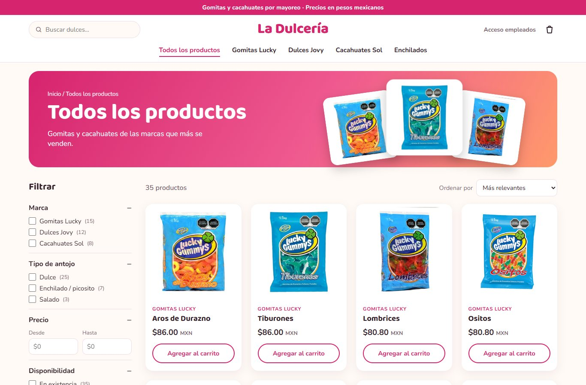
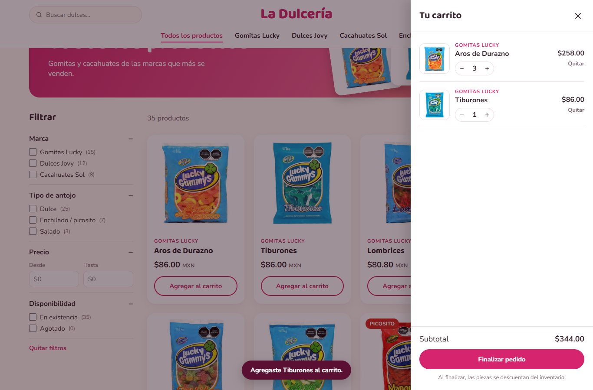
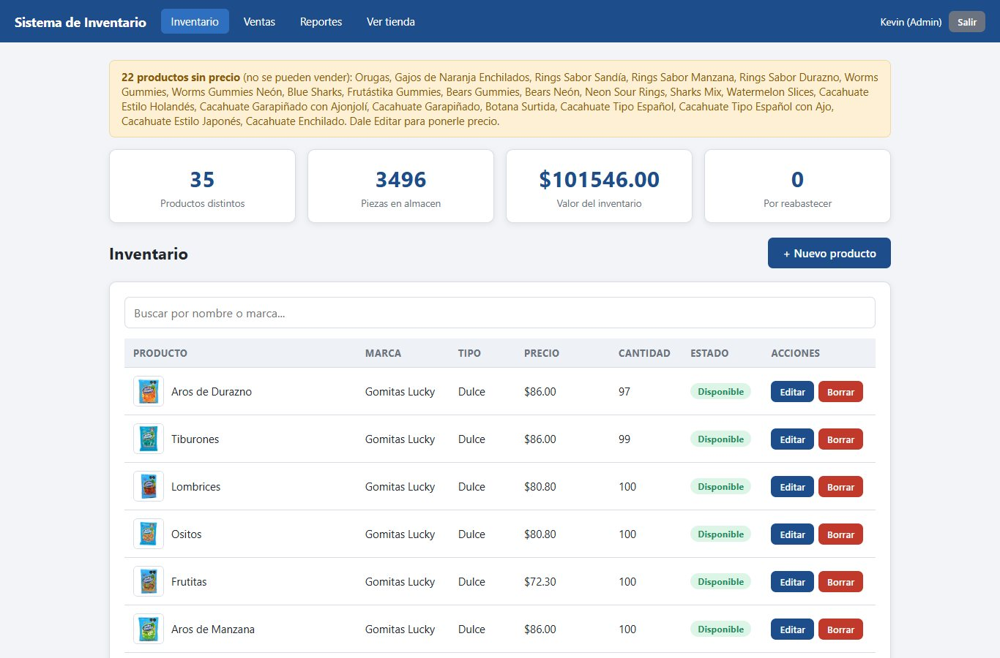
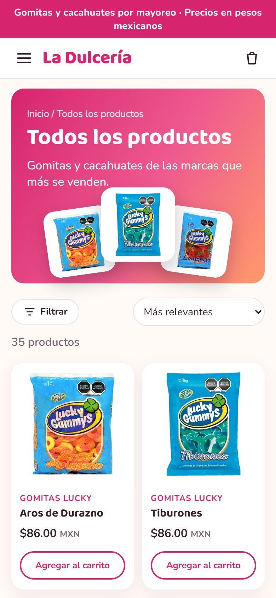

# Tienda en línea + Sistema de Inventario

Tienda web de gomitas y cacahuates (Gomitas Lucky, Dulces Jovy y Cacahuates Sol)
conectada a un sistema de inventario y punto de venta: lo que el cliente compra
en la tienda se descuenta del almacén, y el administrador ve las ventas en reportes.

**Ver funcionando:** https://kevinislas1595.github.io/sistema-inventario/

---

## Capturas

| Tienda | Carrito |
|--------|---------|
|  |  |

| Inventario (admin) | En celular |
|--------------------|------------|
|  |  |

---

## Usuario de prueba

La tienda es pública. Para entrar al sistema interno usa **Acceso empleados**:

| Rol | Correo | Contraseña |
|-----|--------|------------|
| Administrador | `admin@demo.com` | `demo123` |
| Empleado | `empleado@demo.com` | `demo123` |

El administrador puede borrar productos y ver reportes. El empleado solo vende.

---

## Qué hace

**Tienda (para el cliente)**
- Catálogo con 35 productos, fotos, marca y precio.
- Colecciones por marca y sección de enchilados.
- Filtros por marca, tipo de antojo, rango de precio y disponibilidad.
- Buscador y orden por precio o nombre.
- Carrito que no deja pedir más piezas de las que hay en el almacén.
- Al finalizar el pedido, el stock baja solo y la venta aparece en los reportes.

**Sistema interno (para el negocio)**
- **Login con roles** — administrador y empleado ven cosas distintas.
- **Inventario** — agregar, editar, buscar y borrar productos.
- **Punto de venta** — registrar ventas en mostrador.
- **Alertas** — avisa cuando quedan pocas piezas o falta ponerle precio a un producto.
- **Reportes** — ventas del día y del mes, gráfica de 7 días y productos más vendidos.
- **Diseño responsivo** — funciona en computadora y en celular.

---

## Tecnologías

- HTML5, CSS3 y JavaScript (sin frameworks)
- Almacenamiento local del navegador (`localStorage`) en el modo demo
- Preparado para conectarse a **Supabase** (base de datos y login reales)

---

## Cómo usarlo en tu computadora

1. Descarga o clona el repositorio:

   ```bash
   git clone https://github.com/KevinIslas1595/sistema-inventario.git
   ```

2. Abre la carpeta y haz doble clic en `index.html`.

Eso es todo: no necesita instalar nada.

---

## Estructura del proyecto

```
sistema-inventario/
├── index.html        Tienda en línea (portada)
├── login.html        Acceso empleados
├── panel.html        Inventario (lista de productos)
├── ventas.html       Registrar una venta en mostrador
├── reportes.html     Gráficas y totales
├── css/
│   ├── tienda.css    Estilos de la tienda
│   └── estilos.css   Estilos del sistema interno
├── js/
│   ├── datos.js      Productos, ventas y sesión (la única capa de datos)
│   ├── tienda.js     Catálogo, filtros y carrito
│   ├── login.js      Inicio de sesión
│   ├── panel.js      Inventario
│   ├── ventas.js     Ventas
│   └── reportes.js   Reportes
└── img/
    ├── productos/    Fotos de los productos
    └── captura-*.jpg Capturas para este README
```

---

## Pendientes / siguientes pasos

- [ ] Ponerle precio a los productos Jovy y Sol
- [ ] Conectar con Supabase para que los datos se guarden en la nube
- [ ] Exportar reportes a Excel
- [ ] Impresión de ticket de venta

---

## Autor

**Kevin Islas** — [GitHub](https://github.com/KevinIslas1595)

*Las marcas y fotos de producto pertenecen a sus respectivos dueños.*
